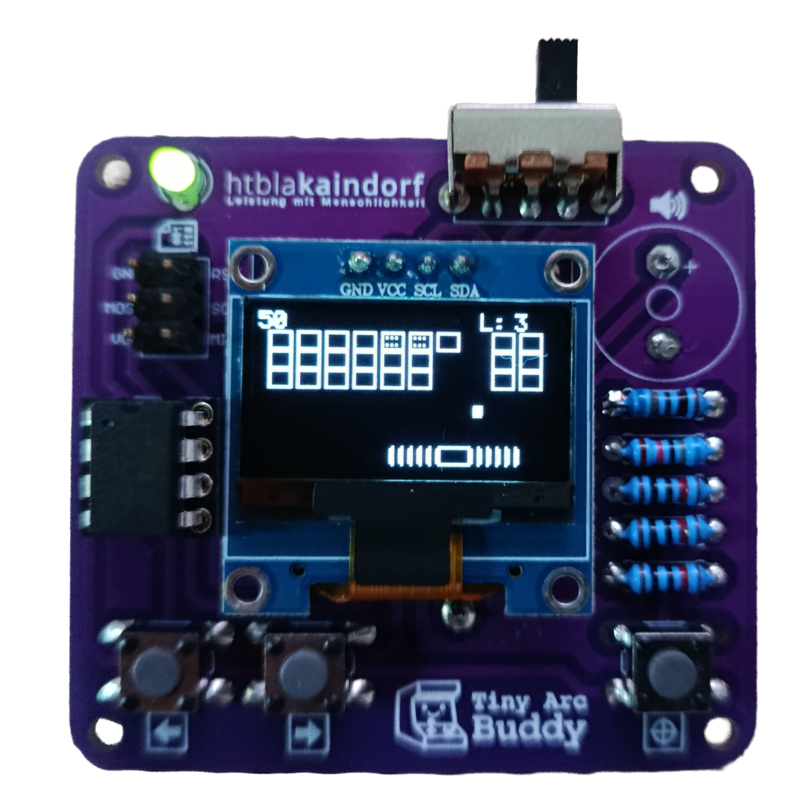
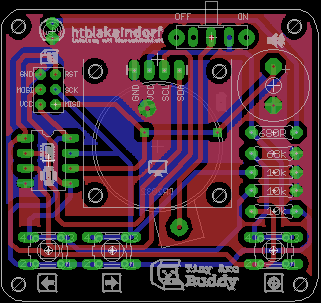
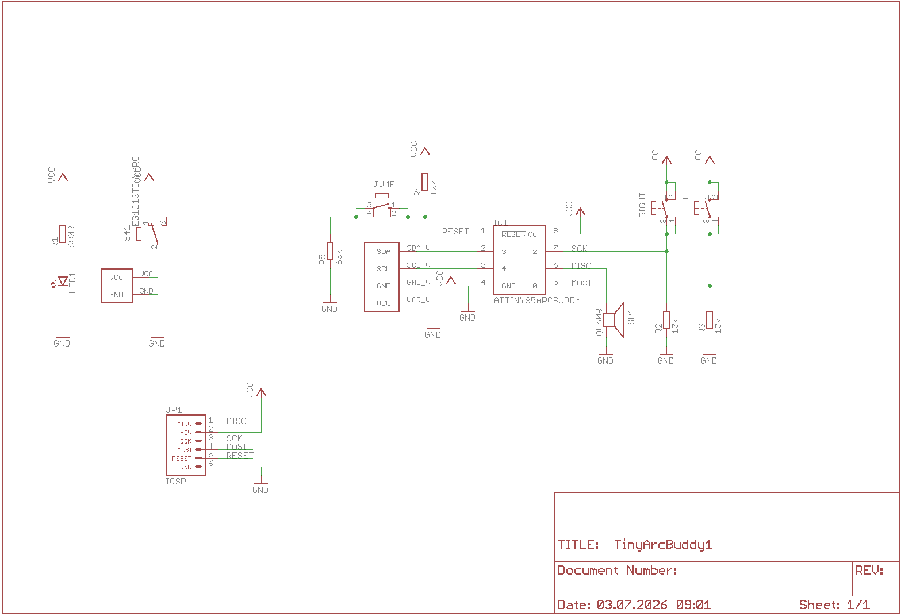

# Tiny Arc Buddy: Embedded STEM Education Platform



An open-source, ATtiny85-based handheld console designed as a dual-purpose platform: a low-level embedded engineering reference and a hands-on STEM educational tool. It is based on the ATtiny85 Tiny Arcade Console by lonesoulsurfer (https://www.instructables.com/Tiny-Arcade-Game-Attiny85).

Developed for STEM workshops, this project aims to demystify hardware assembly and firmware development for 8th-grade middle school students.

---

## 🧠 Pedagogical Approach

The Tiny Arc Buddy is engineered to provide a frictionless, high-impact introduction to STEM for young students without requiring prior programming or electronics experience.

* **Peer-to-Peer Mentoring:** The workshop utilizes a tiered mentoring model. Middle school students act as "Lead Engineers" executing the hands-on work, while older HTL students serve as "Senior Advisors," fostering a collaborative, non-intimidating learning environment.
* **Tangible Milestones:** Hardware assembly is gamified into structural "Levels" (low-profile to high-profile components). This prevents cognitive overload and provides continuous positive reinforcement.
* **Immediate Feedback Loop:** The firmware is structured with a dedicated `ZONE 1: APP SETTINGS`. Students modify straightforward C++ macros (e.g., `#define OWNER_NAME "ANNA"`) and immediately see their changes compiled and rendered on the OLED. This bridges the abstract code-to-hardware gap without bogging them down in syntax errors.
* **Curriculum Alignment:** The software payloads (such as the Affine Linear Function Explorer) directly correlate with the Austrian 8th-grade mathematics and physics curricula, demonstrating the practical application of theoretical school concepts.

---

## ⚡ Hardware Architecture

| **Front Board Layout** | **Schematic Diagram** |
| :---: | :---: |
|  |  |

The hardware is designed around strict BOM constraints, prioritizing low cost, through-hole technology (THT) for beginner soldering, and extreme power efficiency.

* **MCU:** Microchip ATtiny85-20PU (8 KB Flash, 512 Bytes SRAM).
* **Clock:** 8 MHz Internal Oscillator (Fuses must be set; factory 1 MHz will fail I2C timings).
* **Display:** 0.96" I²C SSD1306 Monochrome OLED ($128 \times 64$).
* **Inputs:** * `BTN_LEFT` (PB0) - Direct digital read with internal pull-up.
  * `BTN_RIGHT` (PB2) - Direct digital read with internal pull-up.
  * `BTN_FIRE` (PB5 / ADC0) - Multiplexed via voltage divider (Reset pin constraint).
* **Audio:** Passive Piezo Buzzer driven by PB1.
* **Power:** 3V CR2032 Coin Cell with an SS12F23 slider switch.

> ⚠️ **Hardware Errata / Assembly Note:** > The Piezo Buzzer is routed to PB1 (MISO). Soldering the buzzer *prior* to initial ISP flashing creates signal interference, causing firmware upload failures. The buzzer must be mounted as the final assembly step.

---

## 📑 Bill of Materials (BOM)

| Qty | Component | Designator / Notes |
| :--- | :--- | :--- |
| **1** | Custom PCB | K-Comp / Tiny Arc Buddy revision board |
| **1** | ATtiny85-20PU | Microcontroller (DIP-8 package) |
| **1** | DIL-8 Socket | IC Socket for ATtiny85 |
| **1** | SSD1306 OLED Display | 0.96" I²C Monochrome (128x64) |
| **3** | Resistor 10 kΩ (1%) | Pull-up & voltage divider network |
| **1** | Resistor 68 kΩ (1%) | Battery / Reset line resistor |
| **1** | Resistor 680 Ω (1%) | LED current limiting resistor |
| **3** | Tactile Push Buttons | 6x6 mm Push Buttons (`LEFT`, `RIGHT`, `FIRE`) |
| **1** | Slider Switch | SS12F23 Power Switch |
| **1** | LED 2 mA | Power Indicator Light |
| **1** | CR2032 Battery Holder | **Mount on BOTTOM side of PCB!** |
| **1** | CR2032 3V Battery | Coin Cell Power Source |
| **1** | Passive Piezo Buzzer | **Solder ONLY AFTER programming!** |
| **Tool**| USBasp Programmer | Used for flashing ATtiny85 via DIP-8 socket |

---

## ⚙️ Software Engineering & Memory Optimization

Standard graphics libraries (like Adafruit_SSD1306) require a 1 KB screen buffer, which exceeds the ATtiny85's 512-byte SRAM. The Tiny Arc Buddy firmware bypasses this entirely using custom optimization techniques:

* **Bufferless I²C Rasterization:** The OLED is driven by a custom bit-banged I²C engine (`i2c_start()`, `i2c_write()`). Graphics and text are calculated and pushed to the display pages in real-time, line-by-line, requiring $O(1)$ RAM.
* **Flicker-Free Rendering:** Instead of issuing `oled_clear()` commands, the UI engine employs targeted line-erasure (`clearRestOfLine()`) and fixed-width space padding. This completely eliminates visual artifacts and ghosting during high-frequency loop cycles.
* **Fixed-Point Arithmetic:** To avoid the massive Flash overhead (~1.5 KB) of importing `<math.h>` and utilizing software Floating Point Units (FPU), all physics and geometry calculators use scaled integer math (e.g., storing `3.14` as `314`).
* **PROGMEM Aggregation:** All UI strings, chemical databases, and custom 5x7 compressed hexadecimal font arrays are strictly forced into Flash memory using `pgm_read_byte()` and `pgm_read_word()`.

---

## 🗂️ Repository Structure

```text
.
├── images/
│   ├── Board.png               # PCB component placement & layout render
│   ├── Schematics.png          # Full electronic circuit schematic
├── hardware/
│   ├── TinyArcBuddy.brd        # PCB component placement & layout render
│   ├── TinyArcBuddy1.sch       # Full electronic circuit schematic
│   └── TinyArcBuddy.zip        # Gerber files for PCB manufacturing
├── software/
│   ├── BrickBreaker/           # Brick Breaker Clone
│   ├── LinearFunctions/        # Affine Linear Function Plotter (y = k*x + d)
│   ├── MINTTool/               # SI-Unit aware Math/Physics Engine
│   ├── PeriodicTable/          # 118-Element Relational Database
│   ├── SpaceInvaders/               # Space Invaders
│   ├── TetrisArcade/           # PRNG-driven ATtiny85 Tetris

├── docs/
│   ├── DevelopersGuide.pdf     # Workshop Guide (Student/Tutor Facing)
│   ├── AssortmentBox.pdf       # Kit BOM and assembly order (labels for an assortment box)
│   └── SetupGuide.docx         # Toolchain & driver setup
└── README.md

## 📜 Copyright & Licensing

The **Tiny Arc Buddy** is an open educational project developed by Andreas Kucher. To ensure maximum freedom for educators, students, and makers, this repository uses three distinct open-source licenses tailored to different types of content:

### 💻 Software: MIT License
All firmware and source code (`.ino`, `.cpp`, `.h` files) within this repository are released under the **MIT License**.
*Copyright (c) 2026 Andreas Kucher*

You are free to use, copy, modify, merge, publish, distribute, sublicense, and/or sell copies of the software, provided that the original copyright notice and permission notice are included in all copies or substantial portions of the software.

### 🛠️ Hardware: CERN-OHL-P
All hardware design files, including schematics, PCB layouts, and Gerber files, are licensed under the **CERN Open Hardware Licence Version 2 - Permissive (CERN-OHL-P)**. 
You are free to manufacture, modify, and distribute the physical hardware, provided proper attribution is given to the original designers.

### 📖 Documentation: CC BY 4.0
All educational materials, tutorials, and assembly guides (including the *Developer's Handbook*) are licensed under **Creative Commons Attribution 4.0 International (CC BY 4.0)**. 
You are free to share, translate, and adapt the material for any purpose—even commercially—as long as you give appropriate credit to Andreas Kucher.